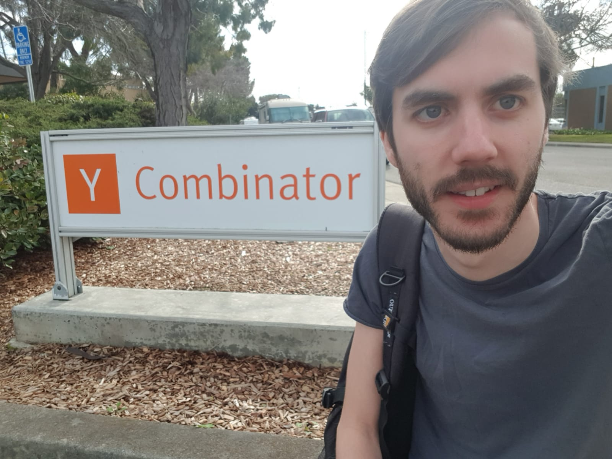

It’s been almost a year since I launched [Snapboard](/snapboard) (which was only week 2 of 1 Product a Week 😅), and I’ve finally decided to take it out of [retirement](/1product-a-week-whats-next/).

It’s been a pretty wild ride since that laucnh, which ended up getting into the [YC](https://ycombinator.com) W20 batch - which was an incredible experience even if it got cut short due to coronavirus (more on that later, but feel free to ping me if you're applying - happy to help)!

I’ve not stopped working on Snapboard, I really believe there is a real need here. But I'm going to take at a little break, and then approach the problem again from a 1 Product a Week perspective. I definitely lost sight of the core problem, and ended up adding to many features and got lost in a swamp of complexity. It became really hard to move quickly.

In the spirit of learning from my mistakes, one major change to the 1PAW criteria will be that **all products will now have an enforced paid plans at launch** - and the success will be evaluated on revenue alone. I'll still be generous with the free plan, but It's really easy to lose focus when you're not getting revenue - and you can end up prioritising the wrong peoples feedback.

Any way, expect more updates from now on 👍 - no matter what I'm going to continue blogging about my experience. The first product is [Relay](/relay) - check it out here, and I’ll be launching it on Product Hunt on Thursday 25th June at midnight (12am PST).

As always, if you have any questions or comments feel free to ping me at calum@1productaweek.com.