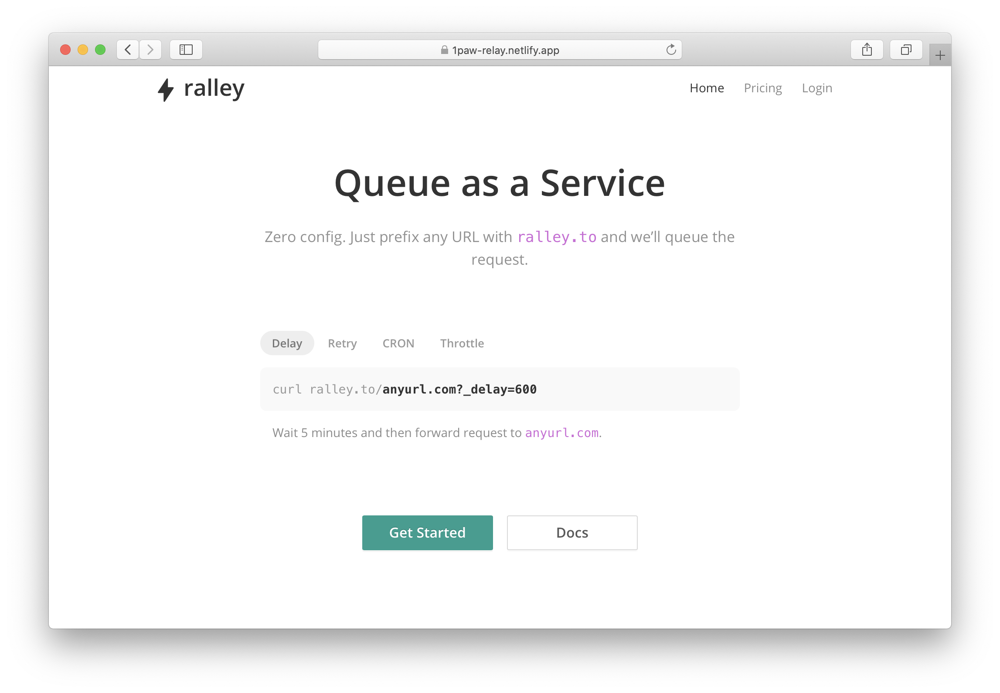
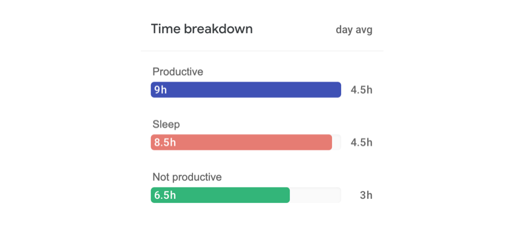
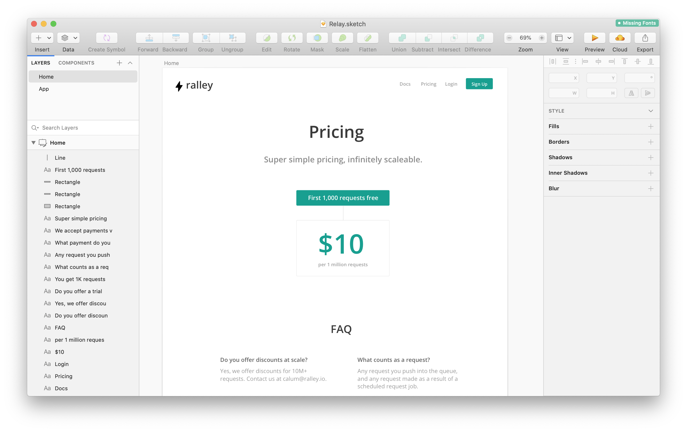
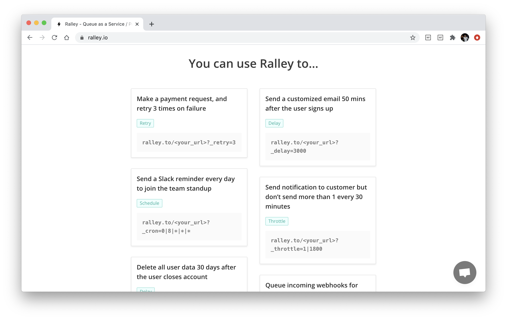
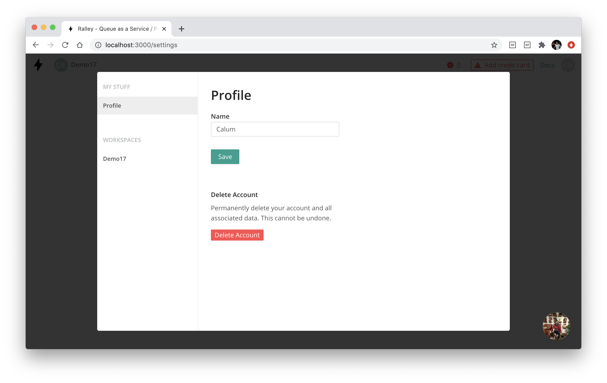
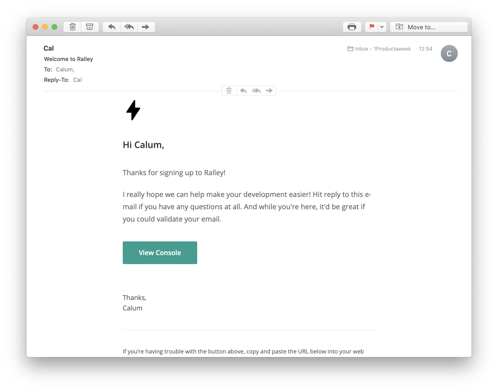

Ralley is a modern managed queue (queue as a service), which requires no setup as it works over HTTPS! Ralley works like any other queue, but instead of pushing jobs, you push requests.

Simply prefix a request with `ralley.to/` and we'll queue and forward the request with the exact same body/headers/parameters. 

No additional configuration for your endpoint, requests can be sent directly as normal (sync) or via the ralley queue (async).

You can use Ralley to:

 * **retry** requests that error automatically or manually

 * **schedule/cron** schedule requests at regular interval
 
 * **delay** requests for a given time (e.g. send a request after 30 mins)

 * **throttle** requests so no more than x requests are allowed in a 30 min period (e.g. when sending activity notifications)

It works great in combination with Zeit.

**Disclaimer: I've pulled the core queue logic for this out of [Snapboard](/snapboard), so you can say I've cheated or just been efficient** 😉. So in this weeks 1PAW, I'll be building the framework around the queue system, rather than the system itself!

## Plan

#### Problem

It's actually quite hard to run delayed (send an email after 30 mins) and scheduled tasks (run a DB clean-up every day) - and this is especially so for serverless. Traditional queues are a pain to setup and often provide little visibility into the status of the jobs.

#### User

Developer - especially if they are using serverless (Zeit, AWS Lambda).

#### Marketing (after PH launch)

  * Communities - target specific communitites
  * Sponsor Github repos

#### Pricing / Revenue

 * First 1000 jobs are free
 * $10 per 1M after that
 * Pricing features:
   * Additional log retention
   * Multiple user accounts 3+
   * Error notifications

#### Competition

[EasyCRON](https://www.easycron.com/) - Only does CRON. Requires setup.

[GCP CRON/PubSub scheduler](https://cloud.google.com/pubsub/docs) - there is no way to view or reprocess jobs. Requires setup.

[AWS](https://aws.amazon.com/sqs/) - limited view or ability to reprocess jobs. Requires setup.

#### Risks / Assumptions

 * Services need to be exposed for us to call them - so it won't work with "internal" services. Obviously people can expose them and add a simple token auth - but this may put some people off. We could also have a dockerized service which you can install and then requests and forwarded from there to our service (which would allow access behind a firewall)

 * How big of a need is this? Only one way to find out though!

#### MVP / Keep it simple

 * Queue a request using the prefix `ralley.to/`
 * Build a 2-page admin app (list/detail view) - incl manual job scheduling 
 * Tags - allows the user to tag the queued request
 * Queue features - delay, schedule, CRON, retry, throttle
 * CLI - to enable development mode (and behind firewall mode) - if there's time

### Out of scope (future ideas)!

 * Globally distribute Redis for even lower latency
 * Library for each language - NodeJS, PHP, Ruby, C, Go, etc
 * Send to multiple API endpoints at once
 * Send from web with progress tracking

## Daily Log

### Day 1
Friday, 19 June 2020

So it's back. Here goes. This is exciting. Well, I'm excited anyway. I've actually only got started on this midway through the day so I'm already a bit behind - but I'm determined to keep to the launch date of Thursday 24 June - and there will always be an excuse to push this back a week.

  - [x] Build initial homepage 
  - [x] Select a UI kit and install it on CRA
  - [x] Update this site!

Not too bad a start considering how few hours I actually had available. I'll need to be more productive going forward though. I've started tracking all my activities over a day, so I can better understand where I'm being productive or not (using [CRON](https://cron.app/)).

### Day 2
Saturday, 20 June 2020

Ok, so on the weekends there will be more less productive time - but I like to code as part of my downtime, so there stuff still gets done.

  - [x] Create a new library - [@1productaweek/react-stately](https://github.com/1productaweek/react-stately), that helps manage form state (extracted from some code on Snapboard)
  - [x] Design permission / data structures
  - [x] Build the login/signup system
  - [x] Reading up on types (again!)

Actually very little got done today, but that's okay! Taking a break for weekends is important.

### Day 3
Sunday, 21 June 2020

More productive today...

  - [x] Create layout for workspace/app console
  - [x] Add user settings dropdown menu
  - [x] Create basic workspace routing, data structures and request API
  - [x] Fixing [@1productaweek/react-fire-hooks](https://github.com/1productaweek/react-fire-hooks) library - Firebase is super flaky!

I spent a lot of time today fixing [react-fire-hooks](https://github.com/1productaweek/react-fire-hooks). It really doesn't like it if you mess around with the `onSnapshot` handler. Anyway, that's now resolved and the library is working well!

### Day 4
Monday, 22 June 2020

First full productive day - here goes!

  - [x] Build the main table for workspace (to list logged requests) - I used [react-table](https://github.com/tannerlinsley/react-table)
  - [x] Add permissions for requesting data from workpspace API
  - [x] Created add workspace modal
  - [x] Started add request modal - didn't quite finish that today

Much better in terms of productivity - which is to be expected given its a work day! Still need to sort out my sleep pattern a bit. I'm really enjoying this tracking! Here's an update on progress:

### Day 5
Tuesday, 23 June 2020

Docs took quite a while - still haven't found a solid service for doing my docs for me! I'm not too happy with the pricing either ($10 for 1M requests). It under-charges lower use cases and over charges upper use cases, and it's really hard at $10 to make anything worthwhile (expect more on this later!)

 - [x] Update 1PAW
 - [x] Create initial pricing page
 - [x] Create initial docs

### Day 6
Wednesday, 24 June 2020

Still hoping to launch tomorrow!

 - [x] Continue working on docs
 - [x] Implement [schedueled (e.g. cron/interval) jobs](https://ralley.io/docs/#schedule)
 - [x] Add use cases to the home page
 - [x] Buy the domain [ralley.io](https://ralley.io)  (getting real!)
 - [x] Add onboarding message when no jobs have been sent yet

### Day 7
Thursday, 25 June 2020

Darn, no launch today (stayed up until 4am to try and get it all done) - still quite a bit outstanding. The launch will have to be next week now 😅 as we don't launch on Fri, Sat, Sun! We're now aiming for Monday, 29 June.

There's still quite a bit to do, not sure how I thought I was going to launch today! 😂

 - [x] Create a [bulk API](https://ralley.io/docs/#bulk) (this took most of the day)
 - [x] Allowed record to be re-processed
 - [x] Strip Ralley headers/params from requests before forwarding
 - [x] Played Call of Duty with a friend! 🔫🔫🔫🔫

### Day 8
Friday, 26 June 2020

I spent a fair bit of time deciding whether to go for [fly.io](https://fly.io) or [GCP](https://cloud.google.com) - in the end I went for GCP. Partly because it's what I'm used to and I like there build/devop tooling (oh and it's free because I'm on the start up plan! 😍)

 - [x] Deploy to staging/production

This took a lot longer than expected - there's a whole bunch to do. I need to better document this process for future projects as a lot of boilerplate is required.

Finished at 8pm today 🙌 - it's the weekend!! 🍺

### Day 9
Saturday, 27 June 2020

It's the weekend so not as productive - still focussed on sorting out a good deployment flow. I will write a blog about this setup at some point.

 - [x] Deploy to staging/production
 - [x] Allow scheduled jobs to be removed/paused

### Day 10
Sunday, 28 June 2020

No work today - spent the day with my girlfriends family!

### Day 11
Monday, 29 June 2020

So, today was another scheduled launch day - which I've missed again. Is this becoming a habbit? I'm still feeling positive, but there is a nagging feeling in my head that this is starting to drag on...

New launch day Wednesday 1 July 2020.

 - [x] Add [react-query](https://github.com/tannerlinsley/react-query) for better caching (for non-firebase based requests)
 - [x] Copied the settings modal from [Snapboard](https://snapboard.io) - we need to find a way of packaging this into something open source, as its the same for all apps!

 

### Day 12
Tuesday, 30 June 2020

Wow, adding billing is hard. I thought I could copy a lot of this from Snapboard, but it turns out that Ralley has quite a different pricing modal AND Snapboard didn't actually enforce limits. I've also been reviewing the pricing stragey and this is what I've come up with

 - [x] Add billing
 - [x] Create e-mail templates for onboarding, etc

 

### Day 13
Wednesday, 1 July 2020

Note to self: YOU HAVE TO LAUNCH TOMORROW 😅. 

 - [x] Continue with billing 😭
 - [x] Enforce provisioned limits and send updates to Stripe

Ah man, did not launch today - we are so close, but there was a few quality issues and I don't want to launch with those.

### Day 13
Thursday, 2 July 2020

NOOOOOOOOOOOOOOOOOOOOOO 😭😭😭😭😭😭 - I stayed up until until 5am but called off the launch because there was just too many small bugs that needed to be cleared up... and I remembered that I hadn't fully finished account deletion - and from my experience, people are really unhappy when you don't let them delete their account - so it's a must.

I feel like the main reason for the delay though is the billing. It took me almost all of yesterday, and meant I didn't have enough time to finish the other stuff - really need to make sure I come up with something repeatable here!

 - [x] Update 1PAW
 - [x] Add more E2E testing of API 
 - [x] Finanlise dealtion of workspace
