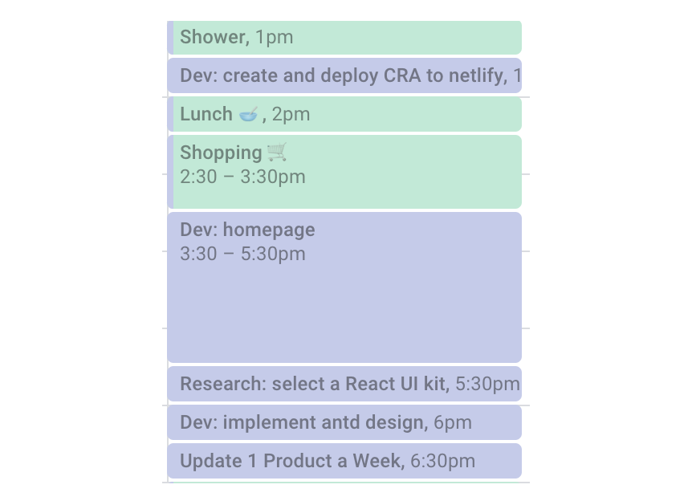
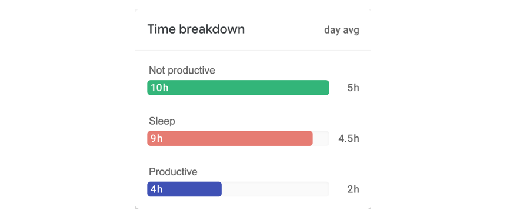
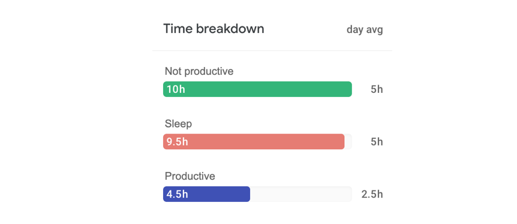
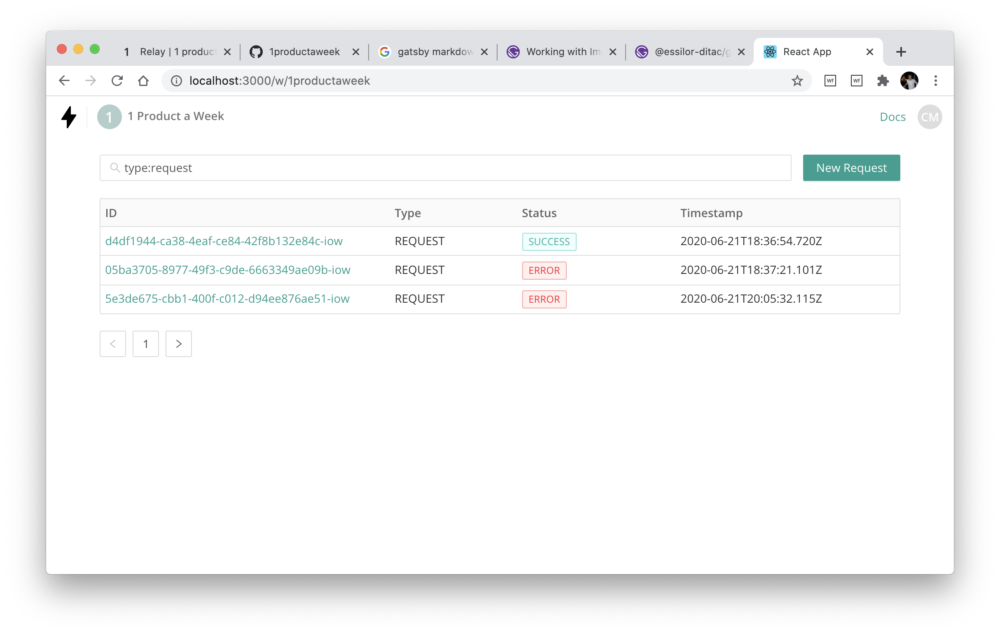

Relay is a modern managed queue (queue as a service), which requires no setup as it works over HTTPS! Relay works like any other queue, but instead of pushing jobs, you push requests.

Simply prefix a request with `relay.to/` and we'll queue and forward the request with the exact same body/headers/parameters. 

No additional configuration for your endpoint, requests can be sent directly as normal (sync) or via the ralley queue (async).

You can use Relay to:

 * **retry** requests that error automatically or manually

 * **schedule/cron** schedule requests at regular interval
 
 * **delay** requests for a given time (e.g. send a request after 30 mins)

 * **throttle** requests so no more than x requests are allowed in a 30 min period (e.g. when sending activity notifications)

It works great in combination with Zeit.

**Disclaimer: I've pulled the core queue logic for this out of [Snapboard](/snapboard), so you can say I've cheated or just been efficient** 😉. So in this weeks 1PAW, I'll be building the framework around the queue system, rather than the system itself!

## Plan

#### Problem

It's actually quite hard to run delayed (send an email after 30 mins) and scheduled tasks (run a DB clean-up every day) - and this is especially so for serverless. Traditional queues are a pain to setup and often provide little visibility into the status of the jobs.

#### User

Developer - especially if they are using serverless (Zeit, AWS Lambda).

#### Marketing (after PH launch)

  * Communities - target specific communitites
  * Sponsor Github repos

#### Pricing / Revenue

 * First 1000 jobs are free
 * $10 per 1M after that
 * Pricing features:
   * Additional log retention
   * Multiple user accounts 3+
   * Error notifications

#### Competition

[EasyCRON](https://www.easycron.com/) - Only does CRON. Requires setup.

[GCP CRON/PubSub scheduler](https://cloud.google.com/pubsub/docs) - there is no way to view or reprocess jobs. Requires setup.

[AWS](https://aws.amazon.com/sqs/) - limited view or ability to reprocess jobs. Requires setup.

#### Risks / Assumptions

 * Services need to be exposed for us to call them - so it won't work with "internal" services. Obviously people can expose them and add a simple token auth - but this may put some people off. We could also have a dockerized service which you can install and then requests and forwarded from there to our service (which would allow access behind a firewall)

 * How big of a need is this? Only one way to find out though!

#### MVP / Keep it simple

 * Queue a request using the prefix `ralley.to/`
 * Build a 2-page admin app (list/detail view) - incl manual job scheduling 
 * Tags - allows the user to tag the queued request
 * Queue features - delay, schedule, CRON, retry, throttle
 * CLI - to enable development mode (and behind firewall mode) - if there's time

### Out of scope (future ideas)!

 * Globally distribute Redis for even lower latency
 * Library for each language - NodeJS, PHP, Ruby, C, Go, etc
 * Send to multiple API endpoints at once

## Daily Log

### Day 1
Friday, 19 June 2020

So it's back. Here goes. This is exciting. Well, I'm excited anyway. I've actually only got started on this midway through the day so I'm already a bit behind - but I'm determined to keep to the launch date of Thursday 24 June - and there will always be an excuse to push this back a week.

  - [x] Build initial homepage 
  - [x] Select a UI kit and install it on CRA
  - [x] Update this site!

Not too bad a start considering how few hours I actually had available. I'll need to be more productive going forward though. I've started tracking all my activities over a day, so I can better understand where I'm being productive or not (using [CRON](https://cron.app/)).

And here's the summary of the day:

### Day 2
Saturday, 20 June 2020

Ok, so on the weekends there will be more less productive time - but I like to code as part of my downtime, so there stuff still gets done.

  - [x] Create a new library - [@1productaweek/react-stately](https://github.com/1productaweek/react-stately), that helps manage form state (extracted from some code on Snapboard)
  - [x] Design permission / data structures
  - [x] Build the login/signup system
  - [x] Reading up on types (again!)

### Day 3
Sunday, 21 June 2020

Ok, so on the weekends there will be less productive time - but I like to code as part of my downtime, so stuff still gets done.

  - [x] Create layout for workspace/app console
  - [x] Add user settings dropdown menu
  - [x] Create basic workspace routing, data structures and request API
  - [x] Fixing [@1productaweek/react-fire-hooks](https://github.com/1productaweek/react-fire-hooks) library - Firebase is super flaky!

I spent a lot of time today fixing [react-fire-hooks](https://github.com/1productaweek/react-fire-hooks). It really doesn't like it if you mess around with the `onSnapshot` handler. Anyway, that's now resolved and the library is working well!

### Day 4
Monday, 22 June 2020

First full productive day - here goes!

  - [x] Build the main table for workspace (to list logged requests) - I used [react-table](https://github.com/tannerlinsley/react-table)
  - [x] Add permissions for requesting data from workpspace API
  - [x] Created add workspace modal
  - [x] Started add request modal - didn't quite finish that today

Much better in terms of productivity - which is to be expected given its a work day! Still need to sort out my sleep pattern a bit. I'm really enjoying this tracking! Here's an update on progress:

And here's the summary of the day:

### Day 5
Tuesday, 23 June 2020

  - [x] Updates to 1PAW and get launch material ready
  - [x] Update design for homepage
  - [ ] Finalize add new request (from yesterday)
  - [ ] Create detail view for request logs

TBC...