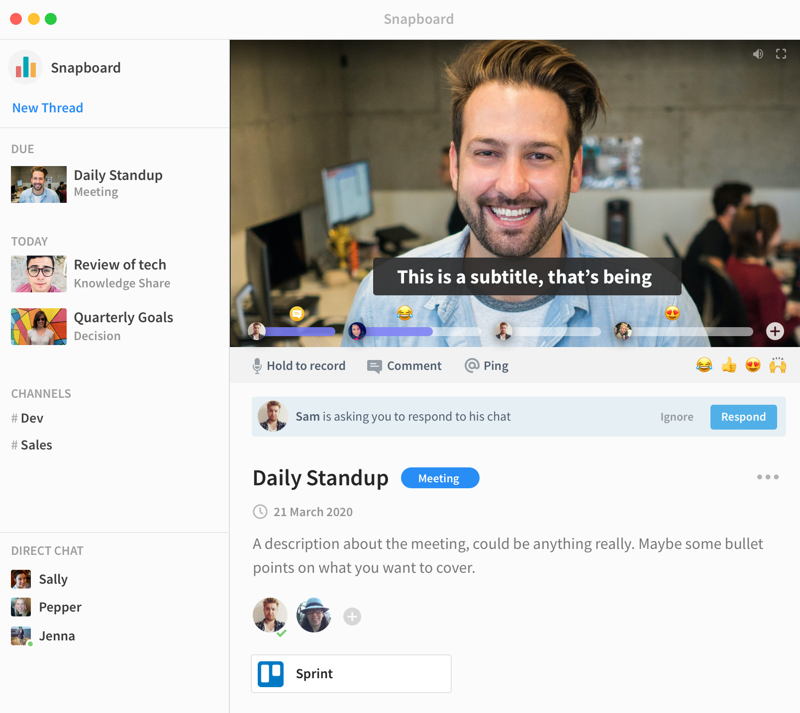

The mission is to create better meetings for teams - a big part of this will be through the async meetings, but I don’t want to narrow the focus to a single feature. 

Whatever “better meetings for teams” means, is the road we will follow.

## Plan

#### Problem

We all attend way to many meetings, and now many of us have gone remote - it's more exhausting than ever. Meetings tend to be a massive distraction and productivity drain, but they serve a useful function.

#### User

Remote teams (right now that’s most office workers - and while expect that not everyone will stay remote, office workers will demand a more hybrid approach to working, ensuring continued demand for virtual meetings).

This is designed to be the perfect companion to Slack / Microsoft Teams, not to replace it.

#### Benefits of async meetings
There’s actually a lot more benefits than you might think!

* Less interruptions - a single interruption can be devastating to productivity, as meetings can be viewed during breaks or at the start/end of the day - you no longer get continual distractions throughout the day
  
* Less time in meetings - with sync calls, you wait around for everyone to join, you have to watch at speed x1, you can’t skip parts that are not relevant, and you often hang around to see if something else comes up. Leading to video call fatigue.
  
* Loudest opinion in the room, is not the only opinion that matters. As an introvert - this is something I’m really passionate about. Let’s make sure everyone has a voice - so we make the best decisions.  
  
* Contributions are more thoughtful - if you have time to think about what you’re going to say, people can form more insightful responses.

#### Downsides of async meetings
These are some obvious downsides for async - I’m listing them here, so I can try to mitigate them as I build the product. It’s interesting that some of these downsides are a direct result of the upside…

* Lack of contribution - if you already at a meeting, you’re more likely to contribute - all you have to do is open your mouth…
  
* People are more obliged to attend a face to face meeting whereas messages can be more easily ignored.
  
* People can overthink video messages - and actually spend more time re-recording themselves than if they just attended a meeting.
  
* Some people don’t like recording video of the themselves.
  
* Async meetings with short back and forth responses may end up being less efficient than being in a meeting together.

#### Initial ideas for combating the downsides
So here are my initial thoughts on how to combat some of these problems - I’ll need to continually revisit this - but it’s a good starting point:

* Async -> sync - he app will be designed to graduate calls from async to sync seamlessly. This has two benefits:
	* Ensures everyone is prepared for the sync meeting, so it can be run more efficiently
	* Encourages people to respond async, so they can avoid the meeting (if everything is resolved, it self destructs!)
  
* Ask to respond - users will be able to ask people to respond to their message/meeting - this will then have to be actively dismissed by the user - “I don’t want to respond”, which brings back some of the social enforcement.
  
* Hold to record - this is designed to prevent people from overthinking things - the user will hold (spacebar) to record the message, so as soon as they remove the hold, the message is stopped/sent. The exact UX experience of this needs to be thought through - but I think something like this might help.

#### Key to success
* Getting people to actively engage with the product. It needs to be something that people default to - the app should be always open.
	* Slack messages - to remind people about meetings / stand ups
	* Weekly e-mails - on time saved?
	* Menu bar - so people can access really easily start a meeting
* Providing some solid initial use cases which are obvious

#### Marketing (after PH launch)

  * Target remote companies > 5 employees
  * Content 
  * Podcasts

#### Pricing / Revenue

 * $10 a month for pro plan (which gives you unlimited everything)

#### Competition

* Zoom, Google Meet, etc - not a direct comparison, but major players in the field
  
* Slack - seems like their launching a stories feature, but I'm not sure that will directly compete

* SodaSync, Comeet - varying degrees of success on PH

## Daily Log

### Pre-Start

I spent the beginning part of the week exploring different ideas - and checking some product / technical assumptions.

As part of the validation, I wanted to get some proof of concepts done on the dev side, nothing worse than building out the app, only to realise the core technology doesn’t work as you expect!

The key things were:
 * Build desktop / screen capture code in electron
 * Hide main window while recoding and overlay video controls (for screen recording)
 * Recording a stream
 * Basic UX experience

I wasn’t sure on the best approach for recording the video - these were the options I thought about:

 1. Store the entire video buffer into memory, and then upload at the end - the easiest option, but the user would have to wait for the upload after the meeting is finished (and if they exited the browser midway through it might be lost!). There was also a risk that the browser would run out of memory if the video was too long.

 2. Send chunks of data manually from the browser to the server using HTTPS - this solved some of the problems with option 1, but 

 3. Use WebRTC protocol to send video to server (and record the stream) - this offered the most future flexibility, but there was quite a bit of added complexity.

I was reluctant to go for option 3, as it seemed like over engineering the solution, but I found very little 

I also spoke to a friend (founder over at [VEED](https://veed.io) about the idea - he told me that his main concerns where: 
* Remote stand ups (this has been done quite a bit, but I think the UX of this could be improved)
* Calendly for his team - a lot of them 

Another friend (founder of [ToDesktop](https://www.todesktop.com/)) also mentioned that there might be an issue with people overthinking their recordings - something I'd considered already, but clearly its a key concern.

I'd love to get your feedback, if you have any of your own thoughts ping me a mail at [calum@1productaweek.com](mailto:calum@1productaweek.com).

### Day 1
Thursday, 26 Nov 2020

Bit of a frustrating start to the day, as I had problems copying the boilerplate over from Snapboard to the new Yabble repo. It seems like new versions of both Typescript and CRA have been released, and this caused a lot of dependency conflicts. In the end, I had to spend the time to update everything (which resulted in quite a few breaking changes that needed to be fixed).

But alas, I now have a basic homepage, login, etc up and running (mostly copied from Snapboard) and I’ve deployed it here - https://yabble.io. Feel free to sign up and explore as I build, but I can't guarantee data will stick around until it’s officially launched next week!

Setup infrastructure - Google Cloud, Sentry, FullStory, Google Analytics, Email, Netlify, Stripe

### Day 2
Friday, 27 Nov 2020

Today, I want to get some basic functionality working:

 * Create a new async meeting
 * Start and record a meeting 
 * Play back recording a message
 * Add a response to an existing meeting

Wow, that's a lot for a Friday - well here goes!